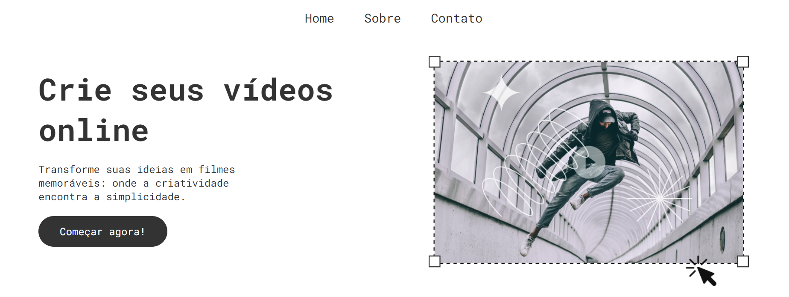

# INTEGRANTES
- **[Guilherme Santos Nunes](https://github.com/sannunez)**
- **[Kairo da Silva Silvestre de Carvalho](https://github.com/KairoSilvestre)**
- **[Kaique Zaffarani](https://github.com/Z4ffarani)**
- **[Rafael Menezes Viana](https://github.com/vianafs)**

<br>

# PROJETO
O projeto Plataforma-Vídeos é uma aplicação web fictícia, desenvolvida para facilitar a criação e publicação de vídeos. Utilizando React.js e styled-components, o projeto inclui as páginas:
- **Home** | A página principal que introduz a plataforma e oferece um botão para começar a usar o serviço.
- **Sobre** | Detalhes sobre a plataforma e os planos de assinatura disponíveis.
- **Contato** | Formulário para dúvidas e suporte.
- **Página 404** | Mostra uma mensagem quando uma página não é encontrada.

<br>

# INSTRUÇÕES
1. Em um terminal, clonar o repositório:
```bash
git clone https://github.com/Z4FFARANI-EDUCATIONAL/SEM2-CP1-WEB-DEVELOPMENT.git
```

2. No terminal, navegar até a pasta do projeto:
```bash
cd SEM2-CP1-WEB-DEVELOPMENT/plataforma-videos
```

3. No terminal, instalar o pacote de módulos do Node.js:
```bash
npm install
```

4. Iniciar o servidor de desenvolvimento:
```bash
npm run dev
```

5. Acessar o site no endereço: http://localhost:5173

<br>

# FUNÇÕES
`Header.jsx`:
- Um componente estilizado que fornece navegação entre as páginas Home, Sobre e Contato.

`Home.jsx`:
- Exibe uma introdução ao serviço e oferece opções de criação de vídeos com links para plataformas populares.

`Sobre.jsx`:
- Apresenta informações sobre a plataforma e planos de assinatura com botões para cadastro ou contato.

`Contato.jsx`:
- Um formulário para os usuários entrarem em contato com a equipe de suporte. Inclui validação de comprimento da mensagem.

`PageNotFound.jsx`:
- Mostra uma mensagem quando a página solicitada não é encontrada.

<br>

# OBSERVAÇÕES
- É necessária a instalação do Node.js para que o programa seja rodado.
- Certificar de que o arquivo `index.html` está corretamente configurado para incluir os códigos de `main.jsx`.
- Os estilos são aplicados através de arquivos CSS e componentes estilizados do styled-components. Assegure-se de que todos os arquivos de estilização estão corretamente importados.
- O roteamento é gerenciado pelo react-router-dom, então deve-se adicionar novas rotas no arquivo `main.jsx` se necessário.

<br>

# TECNOLOGIAS
[](https://vitejs.dev)
[](https://react.dev)
[](https://styled-components.com)
[](https://nodejs.org/en/download/source-code)
[](https://www.npmjs.com/package/react-router-dom)

<br>

# AGRADECIMENTOS
- **[Caio Vinícius Gonçalves de Oliveira](https://github.com/caiooliveira-tech)**
